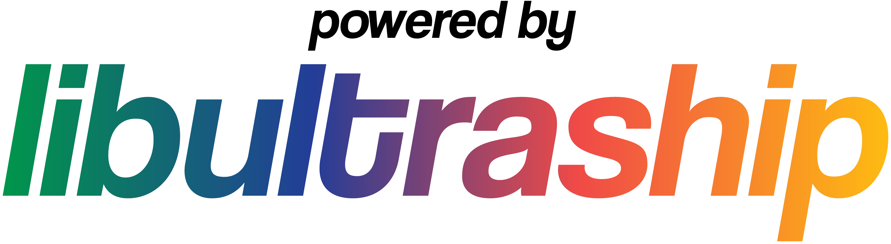

# Lighthouse — mobile and XR fork

[Lighthouse](https://github.com/HarbourMasters/Lighthouse) is the Harbour Masters port of
Banjo-Kazooie. This fork adds the platforms the upstream port does not build yet:

| | |
| --- | --- |
| **Android** | phone and tablet, on-screen pad |
| **Meta Quest 3 / 3S** | the game on a window in your room |
| **Samsung Galaxy XR / Android XR** | the same |
| **iPhone / iPad** | on-screen pad, Metal renderer |
| **Apple Vision Pro** | the game in a volume in the Shared Space |

**On Windows, Linux, macOS or Switch, use [HarbourMasters/Lighthouse](https://github.com/HarbourMasters/Lighthouse/releases)
instead.** That repository is the canonical port. Everything here is sent back to it.

Lighthouse holds no game data. You must supply your own Banjo-Kazooie ROM. We do not condone piracy.

---

## 1. Get a supported ROM

Any retail version works. Check your dump against these SHA-1 sums:

| ROM | SHA-1 |
| --- | --- |
| `baserom.us.v10.z64` | `1fe1632098865f639e22c11b9a81ee8f29c75d7a` |
| `baserom.us.v11.z64` | `ded6ee166e740ad1bc810fd678a84b48e245ab80` |
| `baserom.jp.z64` | `90726d7e7cd5bf6cdfd38f45c9acbf4d45bd9fd8` |
| `baserom.pal.z64` | `bb359a75941df74bf7290212c89fbc6e2c5601fe` |

The file must be `.z64`. Convert an `.n64` with <https://hack64.net/tools/swapper.php>.

## 2. Install the app

### Android, Meta Quest and Galaxy XR — download the APK

Get `Lighthouse-<version>-android-universal.apk` from
[Releases](../../releases).

**One APK covers all three devices.** There is no separate Quest file. It is `arm64-v8a` only, so
it runs on every shipping phone and headset but not on an x86_64 emulator.

* **Android phone or tablet** — copy the APK to the device and open it, or run
  `adb install -r Lighthouse-<version>-android-universal.apk`.
* **Meta Quest 3 / 3S** — turn on developer mode for the headset in the Meta Horizon phone app,
  connect by USB, accept the prompt in the headset, then `adb install -r <apk>`. The app is in the
  library under *Unknown Sources*.
* **Samsung Galaxy XR** — turn on Developer options and USB debugging in Settings, then
  `adb install -r <apk>`.

### iPhone, iPad and Apple Vision Pro — build it with Xcode

Apple permits no sideloading, so there is no download. Build the app on a Mac and run it on your
device from Xcode. See [docs/BUILDING.md](docs/BUILDING.md#ios-iphone--ipad) for iOS and
[docs/BUILDING.md](docs/BUILDING.md#visionos-apple-vision-pro) for Vision Pro.

A free Apple ID is enough. Its profile expires after 7 days and you then build again. A paid
membership gives a one-year profile.

## 3. Give the app the ROM

The app makes `bk.o2r` from your ROM on the first start. This takes a few minutes and needs about
200 MB free.

* **Android, Quest, Galaxy XR** — copy the ROM anywhere on the device, `Downloads` is fine. Start
  the app. It opens the system file picker. Choose the ROM.
* **iPhone, iPad, Vision Pro** — start the app once. It makes a `Lighthouse` folder under *On My
  iPhone* / *On My iPad* / *On My Apple Vision Pro* in the Files app. Copy the ROM into that
  folder and start the app again.

Saves, `lighthouse.cfg.json` and the `mods` folder are in the same place.

---

## Controls

Any MFi or Bluetooth controller that SDL2 knows works on every platform. Pair it in the system
settings first.

### Touch — iPhone, iPad, Android phone and tablet

An on-screen N64 pad is drawn over the game: analog stick on the left, A/B and the C cluster on the
right, L/Z/Start/R along the top. **MENU** opens the port menu. The pad hides itself while a
controller is connected.

Size, reach, opacity, edge margin, a left-handed layout and an optional D-pad are under
*Settings → Controls → On-Screen Controls*.

### Meta Quest and Galaxy XR

The game hangs on a window in front of you. There is no on-screen pad; use the Touch controllers.

| N64 | Touch controller |
| --- | --- |
| Analog stick | left thumbstick |
| A / B | right hand A / B |
| C buttons | right thumbstick |
| D-pad up / left | left hand Y / X |
| L / R | left / right grip |
| Z | either trigger |
| Start | left hand Menu button |

Point a hand or a controller at the window to get a cursor, and pinch or pull the trigger to click.

* The **MENU** tab above the window opens the port menu.
* The **bar under the window** moves it. Pinch and drag; push and pull to set the range.
* The **corner handles** resize it.

### Apple Vision Pro

The game plays in a volume you can place in the room. **A paired game controller is needed to
play** — visionOS gives no pad of its own. The **Menu** button under the volume opens the port
menu, and look-and-pinch drives it. A paired keyboard opens it with Escape.

### Keyboard (desktop and any platform with a keyboard)

| N64 | A | B | L | R | Z | Start | Analog stick | C buttons | D-Pad |
| - | - | - | - | - | - | - | - | - | - |
| Keyboard | X | C | E | R | Z | Space | WASD | Arrow keys | TFGH |

| Keys | Action |
| - | - |
| ESC | Toggle the menu |
| Ctrl+R / ⌘R | Reset |
| F11 | Fullscreen |
| Tab | Toggle alternate assets |

## Headset window settings

*Settings → Graphics*, on a headset only:

| Setting | What it does |
| --- | --- |
| Diorama Depth | How deep the world reaches behind the glass. A small depth is the easiest to look at for a long session. |
| Window Range | How far away the window hangs. |
| Window Size | How large the glass is. |
| Edge Float | Brings the side edges towards you, so the sliver one eye cannot see reads as a near frame. |
| Edge Softness | Fades the picture out at the edge. |
| Max Refresh Rate | The fastest rate the headset is asked to run. Lower it for battery, heat, or if the game runs slowly. |
| Recenter Window | Puts the window where you are looking now. |
| Stereo | Draws once per eye. Turn it off to halve the drawing cost. |

## Graphics backends

Metal on iOS and Vision Pro. OpenGL ES 3.0 on Android and the Android headsets. The desktop
choices are unchanged. Change the backend in *Settings → Graphics*, which needs a restart, or set
`"Backend"` in `lighthouse.cfg.json` if a bad choice stops the app from starting.

## Mods and custom assets

Custom assets are `.o2r` or `.otr` files in the `mods` folder.

* **iPhone, iPad, Vision Pro** — `mods` is inside the `Lighthouse` folder in the Files app.
* **Android, Quest, Galaxy XR** — the app data is in `Android/data/<applicationId>/files`, which
  Android 11 closed to the Files app and to USB. Use `adb push` to reach `mods` and the saves.

Applying a mod list needs the app to be closed and opened again. A mobile app cannot restart
itself.

To pack your own assets, see [retro](https://github.com/HarbourMasters64/retro) and
[fast64](https://github.com/HarbourMasters/fast64).

## Language packs

Lighthouse can use other regions of Banjo-Kazooie as language packs. With `bk.o2r` made, open
*General → Languages* and select another ROM to extract. PAL gives UK, French and German. The
Japanese ROM gives Japanese.

## Romhacks

Many romhacks can be extracted from a patched ROM and used as mods, from *Settings → Romhacks*.
Only US v1.0 is supported as the base, inherited from Banjo's Backpack.

## Anchor multiplayer

Off on iOS, Android and the headsets. SDL2_net is not part of the mobile dependency set.

---

## Building and development

[docs/BUILDING.md](docs/BUILDING.md) has the build for every platform.
[docs/PORTING_PLAYBOOK.md](docs/PORTING_PLAYBOOK.md) records how the mobile and XR ports were made
and what was learned; read it before you work on either area.

A push to a tag builds Windows, Linux and Android and makes a draft release. Apple targets are
built by hand, because CI holds no signing identity.

## Discord

Official Discord: <https://discord.com/invite/shipofharkinian>. Ask in the Lighthouse channels.
Report a fault with a mobile or XR device in this fork's
[issues](../../issues); report a fault the upstream port
shares with [HarbourMasters/Lighthouse](https://github.com/HarbourMasters/Lighthouse/issues).

<a href="https://github.com/Kenix3/libultraship/">
  <picture>
    <source media="(prefers-color-scheme: dark)" srcset="./docs/poweredbylus.darkmode.png">
    
  </picture>
</a>

## Credits

Lighthouse is by Harbour Masters. Lead developer Malkierian; developers JeodC and Caladius.

Special thanks to the Banjo decomp team, and to Fredomato and scorched11 for the randomizer.
